# School_District_Analysis
## Overview of the School District Analysis: 

Maria, the chief data scientist for a city school district, recruited my help to prepare standardized test data for analysis, reporting, and presentation to provide the school board with insights about performance trends and patterns within the district schools. 

After completing the initial analysis, the school board notified Maria that there may have been some academically dishonest reporting of the students grades from Thomas High School(THS), specifically the 9th grade. The school board is concerned with uphold the state-testing standards. Maria then had me go back through the data and replace the scores with "Nan", while keeping the remaining data intact, then repeat the analysis and write a report to describe how the changes affected the overall analysis.

### 7 Metrics Measured:
- Total Students
- Total Budget
- Average Math Score
- Average Reading Score
- % Passing Math
- % Passing Reading
- % Overall Passing

## Results of the School District Analysis:

- District Summary

As seen in the data below, removing THS 9th grade had little impact on the districts scores or passing percentages.

#### Initial District Summary 
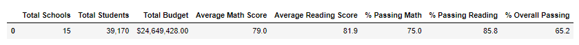

#### District Summary After Removing THS 9th Grade Scores 
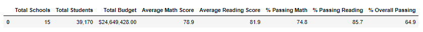

- School Summary

When looking at the school summaries of the top five schools, you can see that the removals of THS 9th grade hardly had an affect on the scores or percentages on the school itself or where is stood in relation to the other schools.

#### Initial School Summary, Showing Top 5 Schools
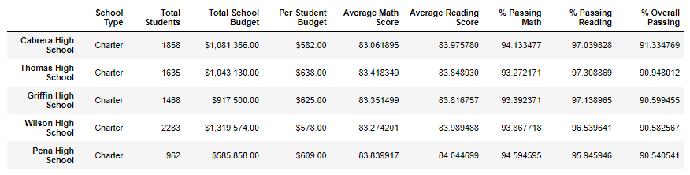

#### School Summary, Showing Top 5 Schools After Removing THS 9th Grade Scores
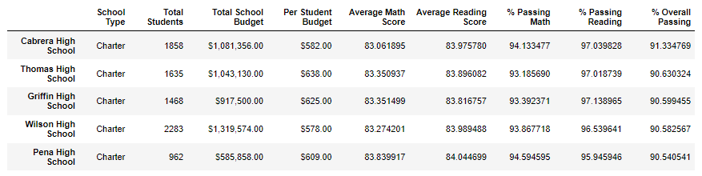

## Additional Results Reviewed

As shown in the reporting below, after removing the Thomas High School 9th grade scores, there was no change in math and reading scores by grade, school spending, school size,or school type.

- Math Scores by Grade

#### Initial Math Scores by Grade 
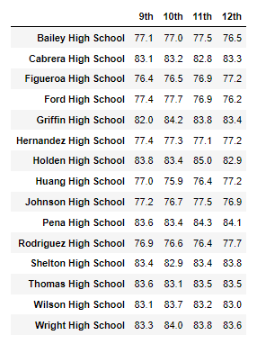   

#### Math Scores by Grade After Removing THS 9th Grade Scores
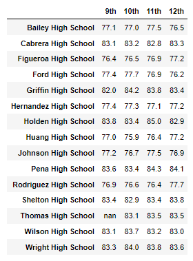

- Reading Scores by Grade

#### Initial Reading Scores by Grade
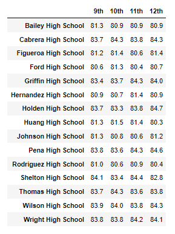 

#### Reading Scores by Grade After Removing THS 9th Grade Scores
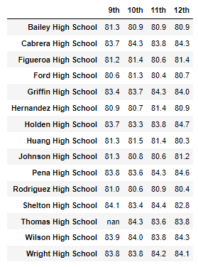

- School Spending Summaries

#### Initial School Spending Summary
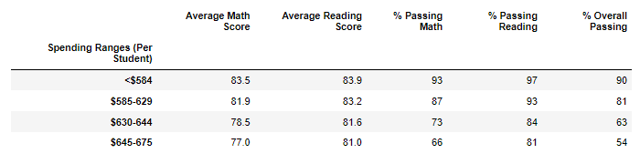

#### School Spending Summary After Removing THS 9th Grade Scores
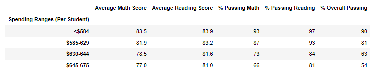

- School Size Summaries

#### Initial School Size Summary
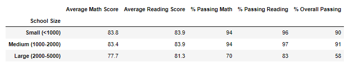

#### School Size Summary After Removing THS 9th Grade Scores
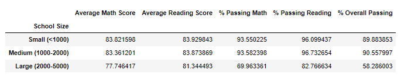

- School Type Summaries

#### Initial School Type Summary
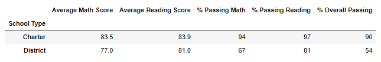

#### School Type Summary After Removing THS 9th Grade Scores
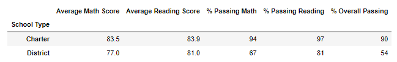

## Summary of the School District Analysis: 
After changing the math and reading scores of the entire 9th grade at Thomas High School, there were relatively few differences showing up in the district analysis. Thomas High School was the second from the top of all district schools prior to the change and remained there after. The differences were minimal, so if there was some academic dishonesty, the extent was minimal and it did not significantly impact the school numbers nor did it impact the district numbers. The overall analysis shows that there was no difference in school spending, school size, and school type with or without the THS 9th grade scoores.

The final analysis shows that schools that spent $584 or less per student brought a better result of overall passing at 90%, schools in the "Medium" size range had the best overall passing percent at 91%, and charter schools outperformed the district schools at 90% vs 54% overall passing.
