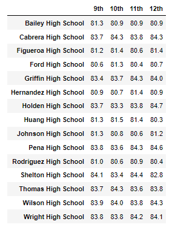
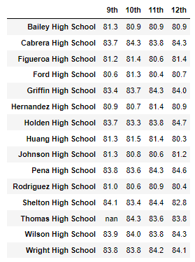
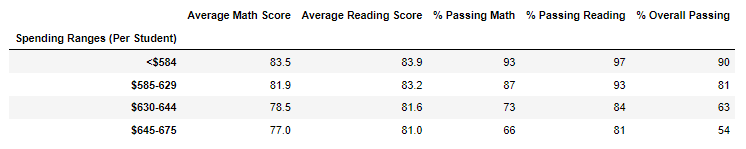
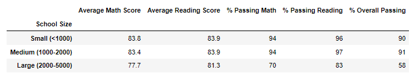
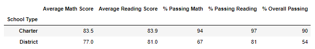

# School_District_Analysis
## Overview of the school district analysis: Explain the purpose of this analysis.

## Results: Using bulleted lists and images of DataFrames as support, address the following questions.

- How is the district summary affected?

- How is the school summary affected?
  - How does replacing the ninth graders’ math and reading scores affect Thomas High School’s performance relative to the other schools?

- How does replacing the ninth-grade scores affect the following:
- Math and reading scores by grade

  - Math Scores

     

 - - Reading scores

    

  - Scores by school spending

  
  

  - Scores by school size

  
  

  - Scores by school type

  
  

## Summary: Summarize four changes in the updated school district analysis after reading and math scores for the ninth grade at Thomas High School have been replaced with NaNs.

